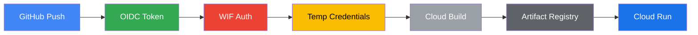

# 🚀 KRV GitHub → Google Cloud CI/CD Setup

This document explains how to connect any **KRV Analytics repository** (e.g. `krv-web`, `sentinel-ui`, `compass-ui`) to the
shared Google Cloud deployment pipeline managed via `.github-private`.

---

## 🧭 Overview

KRV’s CI/CD pipeline uses **GitHub Actions** + **Google Cloud Workload Identity Federation (WIF)**  
to deploy applications **without service account keys**.

All build and deploy logic is centralized in the private repo:  
**`Krv-Analytics/.github-private`**

Each product repo:

- defines two secrets (project + number)
- includes a _thin workflow_ that calls the reusable pipeline
- automatically uses the shared `Dockerfile` and `cloudbuild.yaml` templates stored in `.github-private`

### 🔁 Flow Summary



---

## 🔐 1️⃣ Configure Repository Secrets

Each repository that deploys to GCP (e.g. `krv-web`) needs **three secrets**.

In your repo, go to:
**Settings → Secrets and variables → Actions → New repository secret**

| Secret                   | Description                                                                  | Example          |
| ------------------------ | ---------------------------------------------------------------------------- | ---------------- |
| `GCP_PROJECT_ID`         | The Google Cloud project ID that this repo deploys to                        | `krv-ai-website` |
| `PROJECT_NUMBER`         | The numeric project number (found via `gcloud projects describe PROJECT_ID`) | `106793116153`   |
| `ARTIFACT_REGISTRY_REPO` | The Artifact Registry repository name                                        | `web-apps`       |

> 🔒 _Do not add service account keys — WIF replaces them entirely._
> 🔒 _Region and service names are specified in the workflow for transparency._

---

## ⚙️ 2️⃣ Using the Shared Deployment Workflow

The shared pipeline is stored at:
`Krv-Analytics/.github-private/.github/workflows/deploy-reusable.yaml`

Every product repo simply _calls_ that workflow with its metadata.

Create this file in your repo:
**`.github/workflows/deploy.yaml`**

```yaml
name: 🚀 Deploy via Shared Workflow

on:
  push:
    branches: ["main"]

jobs:
  deploy:
    uses: Krv-Analytics/.github-private/.github/workflows/deploy-reusable.yaml@main
    with:
      region: us-central1 # GCP region
      service: krv-web # Cloud Run service name
    secrets:
      GCP_PROJECT_ID: ${{ secrets.GCP_PROJECT_ID }}
      PROJECT_NUMBER: ${{ secrets.PROJECT_NUMBER }}
      ARTIFACT_REGISTRY_REPO: ${{ secrets.ARTIFACT_REGISTRY_REPO }}
```

---

## 🧱 3️⃣ What the Shared Workflow Does

The shared file (`deploy-reusable.yaml`) performs these steps automatically:

| Step                | Description                                                                                          |
| ------------------- | ---------------------------------------------------------------------------------------------------- |
| **Authenticate**    | Uses `google-github-actions/auth@v2` to impersonate `github-cicd@PROJECT_ID.iam.gserviceaccount.com` |
| **Set up gcloud**   | Installs the GCP CLI via `google-github-actions/setup-gcloud@v2`                                     |
| **Clone templates** | Fetches `.github-private/templates/cloudbuild.yaml` and `.github-private/templates/Dockerfile`       |
| **Run Cloud Build** | Executes `gcloud builds submit` with the appropriate substitutions                                   |
| **Deploy**          | Cloud Build deploys to Cloud Run using the built image                                               |

---

## 🧩 4️⃣ Default Template Behavior

The workflow defaults to the shared templates stored in `.github-private/templates/`.

| Template          | Purpose                                              |
| ----------------- | ---------------------------------------------------- |
| `cloudbuild.yaml` | Defines build → push → deploy pipeline               |
| `Dockerfile`      | Standard Node/Next.js container used by all UI repos |

You can override these later if you need a custom build (e.g., different runtime).

---

## 🔑 5️⃣ Initial Environment Variable Setup (One-Time)

Once your Cloud Run service is created, set its runtime environment variables:

```bash
gcloud run services update krv-web \
  --region=us-central1 \
  --update-env-vars \
NODE_ENV=production,\
NEXTAUTH_URL=https://krv.ai,\
NEXTAUTH_SECRET=<your_secret>,\
GOOGLE_CLIENT_ID=<your_client_id>,\
GOOGLE_CLIENT_SECRET=<your_client_secret>
```

Check them anytime:

```bash
gcloud run services describe krv-web --region=us-central1 --format="flattened(spec.template.spec.containers[].env[])"
```

---

## 🧩 6️⃣ Example Repository Structure

```
krv-web/
├── .github/
│   └── workflows/
│       └── deploy.yaml      ← the thin workflow above
├── package.json
├── next.config.js
├── public/
├── pages/
└── components/
```

Everything else (build logic, image push, deployment) lives in `.github-private`.

---

## 🧠 7️⃣ Customization

If you need per-repo custom behavior:

| Use Case                      | How to Do It                                                        |
| ----------------------------- | ------------------------------------------------------------------- |
| Custom region or service name | Override `region` or `service` in your `deploy.yaml`                |
| Custom template branch        | Add `template_branch: dev` under `with:` inputs                     |
| Custom cloudbuild file        | Add `cloudbuild_path: ./build/cloudbuild.yaml` under `with:` inputs |
| Custom Dockerfile             | Add `dockerfile_path: ./docker/Dockerfile` under `with:` inputs     |

---

### Use a repo-local Dockerfile

If your repository contains its own Dockerfile (for example `./Dockerfile` or `./docker/Dockerfile`), you can tell the reusable workflow to use it instead of the shared template.

Example `.github/workflows/deploy.yaml` that uses a repo-local Dockerfile:

```yaml
name: Deploy with local Dockerfile

on:
  push:
    branches: [main]

jobs:
  deploy:
    uses: Krv-Analytics/.github-private/.github/workflows/deploy-reusable.yaml@main
    with:
      region: us-central1
      service: krv-web
      dockerfile_path: ./docker/Dockerfile # Use local Dockerfile
    secrets:
      GCP_PROJECT_ID: ${{ secrets.GCP_PROJECT_ID }}
      PROJECT_NUMBER: ${{ secrets.PROJECT_NUMBER }}
      ARTIFACT_REGISTRY_REPO: ${{ secrets.ARTIFACT_REGISTRY_REPO }}
```

### Use both local Dockerfile AND cloudbuild.yaml

For maximum customization, you can specify both a local Dockerfile and a local cloudbuild.yaml:

```yaml
name: Deploy with local files

on:
  push:
    branches: [main]

jobs:
  deploy:
    uses: Krv-Analytics/.github-private/.github/workflows/deploy-reusable.yaml@main
    with:
      region: us-central1
      service: krv-web
      dockerfile_path: ./build/Dockerfile # Use local Dockerfile
      cloudbuild_path: ./build/cloudbuild.yaml # Use local Cloud Build config
    secrets:
      GCP_PROJECT_ID: ${{ secrets.GCP_PROJECT_ID }}
      PROJECT_NUMBER: ${{ secrets.PROJECT_NUMBER }}
      ARTIFACT_REGISTRY_REPO: ${{ secrets.ARTIFACT_REGISTRY_REPO }}
```

**Repository structure example:**

```
my-custom-app/
├── .github/workflows/deploy.yaml
├── build/
│   ├── Dockerfile           ← custom container definition
│   └── cloudbuild.yaml      ← custom build pipeline
├── src/
└── package.json
```

**Notes:**

- Both `dockerfile_path` and `cloudbuild_path` are optional
- Paths are relative to the repository root
- If not specified, the workflow uses shared templates from `.github-private/templates/`
- Local files take precedence over templates

## 🔍 8️⃣ Troubleshooting

| Symptom                                                | Cause                                 | Fix                                                                    |
| ------------------------------------------------------ | ------------------------------------- | ---------------------------------------------------------------------- |
| `forbidden from accessing bucket _cloudbuild`          | Missing IAM on Cloud Build bucket     | Grant `roles/storage.admin` to `github-cicd@...`                       |
| `artifactregistry.repositories.uploadArtifacts denied` | Missing writer role                   | Grant `roles/artifactregistry.writer`                                  |
| `billing account not found`                            | Project not linked to billing         | `gcloud billing projects link PROJECT_ID --billing-account=ACCOUNT_ID` |
| `OIDC authentication failed`                           | Incorrect workload identity binding   | Double-check `principalSet://...` string matches repo name             |
| Build succeeds but doesn’t deploy                      | Check Cloud Build logs in GCP Console | Enable `cloudbuild.googleapis.com`                                     |

---

## ✅ 9️⃣ Summary

| Step | Action                                                         | Location                        |
| ---- | -------------------------------------------------------------- | ------------------------------- |
| 1️⃣   | Create 3 repo secrets (project, project number, artifact repo) | GitHub → Settings → Secrets     |
| 2️⃣   | Add thin workflow file                                         | `.github/workflows/deploy.yaml` |
| 3️⃣   | Push to `main`                                                 | Triggers build + deploy         |
| 4️⃣   | Monitor deployment                                             | Cloud Run & Cloud Build logs    |
| 5️⃣   | Adjust env vars                                                | `gcloud run services update`    |

---

**End Result:**
All KRV Analytics web apps deploy to Google Cloud Run securely, with unified Docker and Cloud Build logic centralized in `.github-private`.

---

```

---

✅ **You now have**:
- a self-contained CI/CD doc for your organization
- step-by-step setup for any new repo
- consistent, zero-key Google authentication via WIF

Would you like me to add a small **“CI/CD verification checklist”** (a one-page onboarding version) for new repos that engineers can follow before their first deployment?
```
