<h1 align="center">
  <strong>Krv Analytics</strong>
</h1>

  <em>POSIX for AI integrations — a unified protocol layer that abstracts enterprise data complexity so AI systems deploy anywhere without migrations.</em>
   
  
    Krv lets companies turn private data and workflows into custom AI APIs — without moving or exposing their data.  
    Powered by a hypergraph-based AI engine, Krv securely connects to existing systems, learns how they work, and instantly generates explainable, enterprise-ready AI capabilities that can optimize your business.
  

  
  
  

---

```mermaid
%%{init: { 'theme': 'base', 'themeVariables': { 'git0': '#93a7c7', 'git1': '#d0d0d0', 'git2': '#e0e0e0', 'git3': '#f0f0f0', 'gitBranchLabel0': '#000000', 'gitBranchLabel1': '#000000', 'commitLabelColor': '#000000', 'commitLabelBackground': 'transparent', 'tagLabelColor': '#000000', 'tagLabelBackground': 'transparent', 'tagLabelBorder': 'transparent'}} }%%
gitGraph TB:
    commit id: "Enterprise Data Sources" tag: "SAP • ERP • Data Lakes"
    commit id: "IoT & API Streams" tag: "Real-time"

    branch hypergraph-layer
    commit id: "Hypergraph Compiler" tag: "Zero-copy"
    commit id: "Unified Representation" tag: "Connect Silos"
    commit id: "Semantic Playground" tag: "AI-Native"
    commit id: "Policy-Aware Access" tag: "Enforce Org Security"


    branch ai-reasoning
    commit id: "Dynamic Data Curation" tag: "Context Aware Cleaning"
    commit id: "Agentic Modeling" tag: "Lightweight Custom Models"
    commit id: "Cloud-Native Training" tag: "Private Learning"

    checkout hypergraph-layer
    merge ai-reasoning tag: "Integrated Enterprise Intelligence"

    branch orchestration
    commit id: "Natural Language Interface" tag: "Understand User Goals"
    commit id: "Workflow Engine" tag: "Plan & Execute Tasks"
    commit id: "Zero-Shot API Generator" tag: "Create Optimal Endpoints"

    checkout main
    merge hypergraph-layer tag: "Core Platform"
    merge orchestration tag: "Iteration and Deployment"

    commit id: "Deployed AI Solutions" tag: "Custom, Org-Specific APIs"
    commit id: "Live Integration" tag: "No Data Migration"
```

We also like spending way too much time on viz 🤷
  

